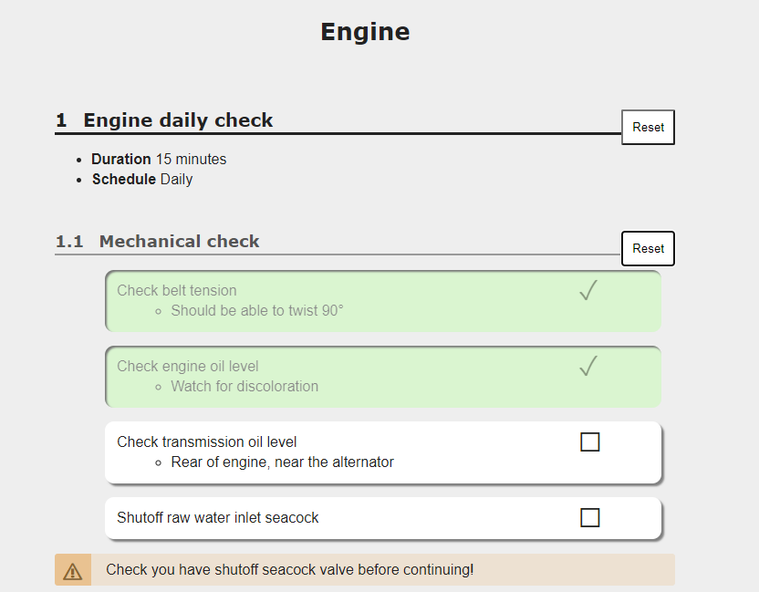

# markdeep_checklist
Adds simple, clickable checklists to [Markdeep](https://casual-effects.com/markdeep/) documents. Makes it quick and easy to create action checklists. Checks are persisted in the brower's local storage, 
so refreshing the page won't lose your checks.



```markdown

   **Engine**
    
# Engine daily check

* **Duration** 15 minutes
* **Schedule** Daily

## Mechanical check

- [ ] Check belt tension
    - Should be able to twist 90 degrees
- [ ] Check engine oil level    
    * Watch for discoloration    
- [ ] Check transmission oil level
    * Rear of engine, near the alternator
- [ ] Shutoff raw water inlet seacock
!!! WARNING
    Check you have shutoff seacock valve before continuing

```

## Usage

Add the following to your `.md.html` file, just before including `markdeep`

```html
<link rel="stylesheet" href="markdeep_checklist.css" type="text/css" ></link>
<script src="md_checklist.js"> </script>
<script>
window.markdeepOptions = {tocStyle:'none', onLoad:make_checks};
</script>
```
